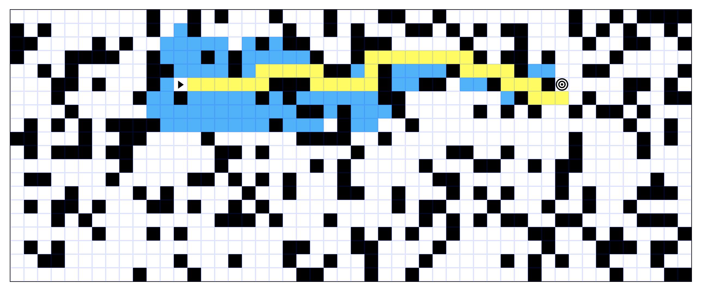

# Pathfinging Project

  

This project is a JavaScript implementation of various pathfinding algorithms (that allows you to see them in action), designed to find the most efficient (depending on the chosen algorithm) path between two cells on a grid. In addition there is the functionality of generating random mazes.

## Live Demo

https://path-finding-visualizer-demo.netlify.app/
